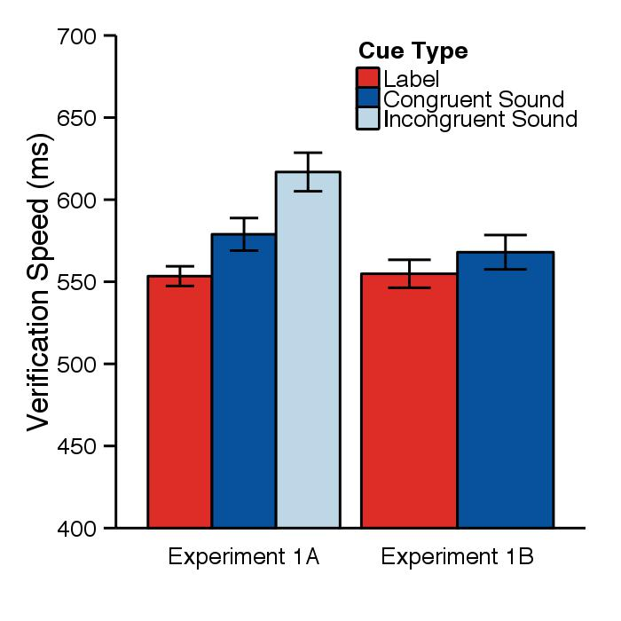
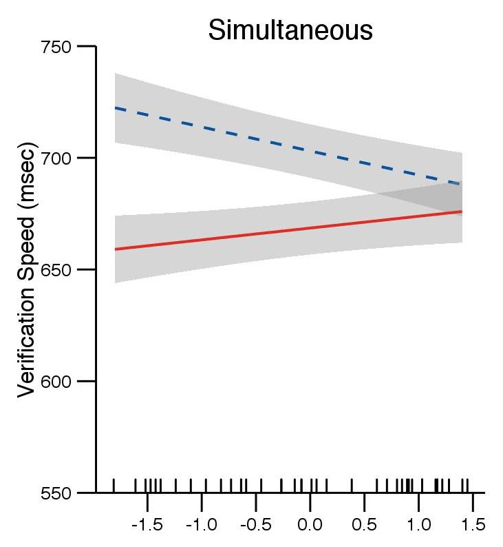
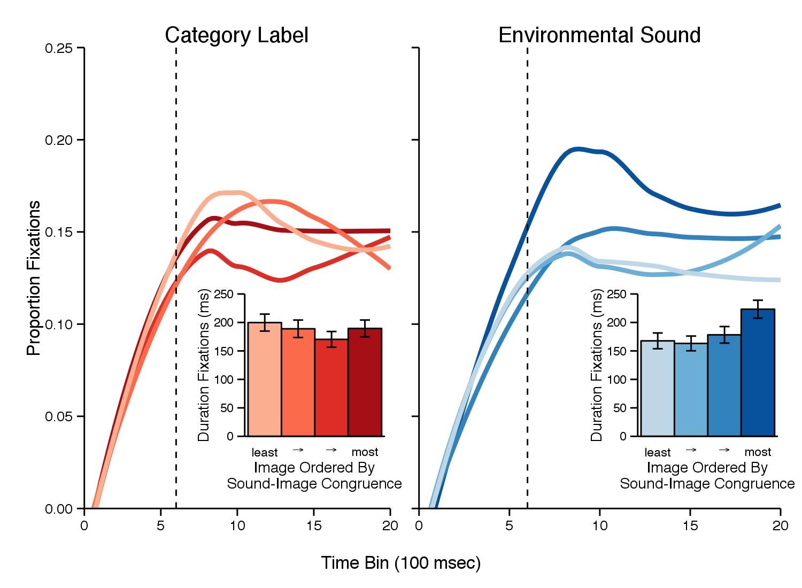
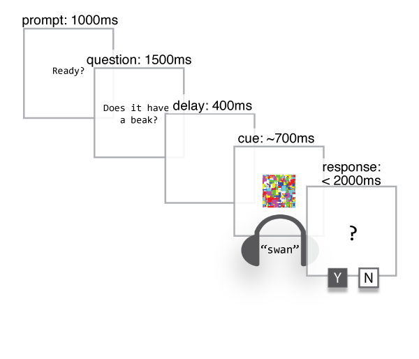
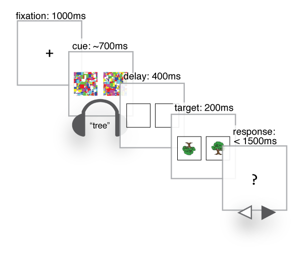
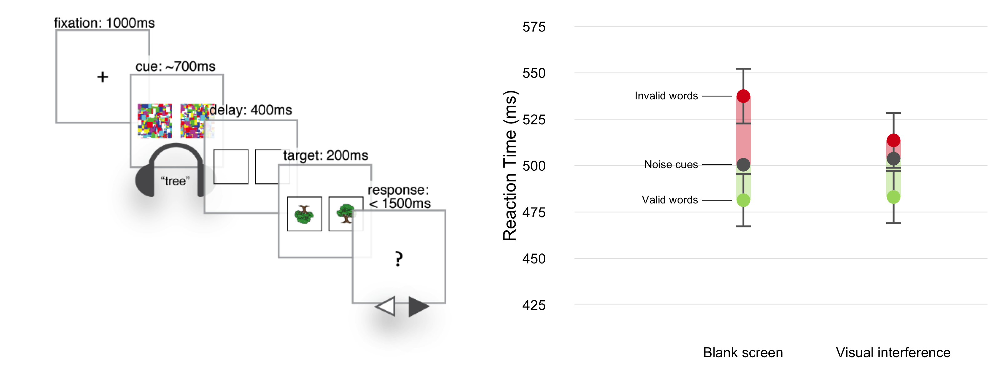

# How are word meanings represented in the brain?

```{r config, echo = FALSE, message = FALSE, warning = FALSE}
library(knitr)
opts_chunk$set(
  echo = FALSE,
  message = FALSE,
  warning = FALSE,
  dev = "png",
  fig.align = "center",
  fig.path = "figs/",
  cache.path = ".cache"
)

library(printr)
library(crotchet)
read_all_graphviz_chunks("motivatedcues")

# read_chunk("src/motivated-cues.R")
read_chunk("src/property-verification.R")
# read_chunk("src/orientation-discrimination.R")
```

<aside class="notes">
I study how word meanings are represented in the brain. Specifically what I’m interested in is how word meanings are represented differently than other types of information or meaning that we learn from the environment around us.
</aside>

```{r dog, fig.cap = ""}
library(magrittr)
library(png)
library(grid)

dog <- "img/dog.png" %>% readPNG %>% rasterGrob
grid.newpage()
grid.draw(dog)
```

<audio src="http://sapir.psych.wisc.edu/meri/bark.wav" controls>

<aside class="notes">
An example I use a lot is the canonical dog. So you all know what dogs are and what they look like, and there are a few different ways I can get you to think about dogs -- different ways I can activate your knowledge about dogs. I can show you this picture of course but I can also just say the word “dog” and hearing this word will activate at least some of your knowledge about dogs.

But I don’t need to use language, I bet I can get you all to think about dogs by playing you this sound.
</aside>

# Cues to the same concept

```{r example-cues, results = 'asis'}
data.frame(
  word = c("dog", "cat", "chainsaw", "bowling ball"),
  sound = c("`<bark>`", "`<meow>`", "`<revving>`", "`<crashing pins>`")
)
```

<aside class="notes">
So the first experiment I'm going to tell you about compares these two types of cues: verbal and nonverbal cues to arguably the same concept, like the word "dog" and the sound of a dog <bark>. Here are some of the other categories we included in this experiment.

What's important to note is we've got both animal sounds and non-animal sounds, and that these differ in state.
</aside>

# Sound-picture congruence

```{r sound-picture-congruence}
library(jpeg)

pictures <- c("guitar_acoustic", "guitar_electric") %>%
  lapply(function (x) {
    paste0(x, ".jpg") %>% file.path("img", .) %>% readJPEG
  })
grid.newpage()
grid.draw(rasterGrob(pictures[[1]], x = 0.2, width = 0.8))
grid.draw(rasterGrob(pictures[[2]], x = 0.8, width = 0.8))
```

# Picture verification task

##

```{r picture-verification-task, engine = "dot"}
```

##



##



##



# So... word meanings are symbolic?

# Property verification

##



##

```{r property-verification-results}
```

# Orientation discrimination

##



##


