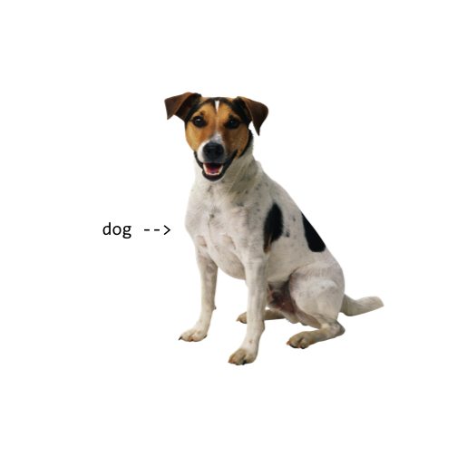
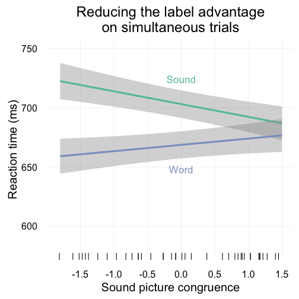
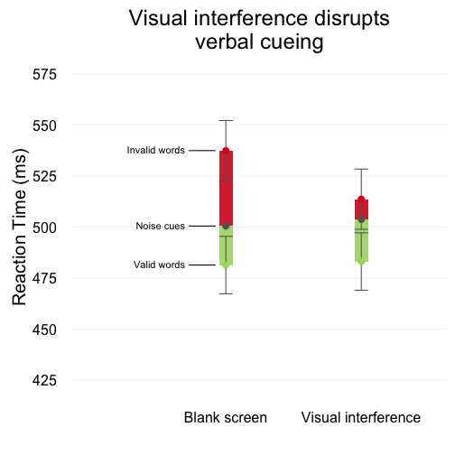

# How do words activate meaning?
 
<aside class="notes">
I study how words activate meaning in the brain. Specifically what I’m interested in is how words activate meaning differently than other types of information that we take in through our senses.
</aside>

<aside class="notes">
An example I use a lot is the canonical dog. I can get you to think about dogs by showing you this picture of course, but I can also just say the word "dog", and hearing that word will activate at least some of your knowledge about dogs. But I don't have to use language, I bet I can get you to think about dogs by playing you this sound. If all I'm trying to do is get you to think about dogs, how do these two cues compare?
</aside>

  <audio src="http://sapir.psych.wisc.edu/meri/dog.wav" controls>
    ["dog"](http://sapir.psych.wisc.edu/meri/dog.wav)
  </audio>
   
  <audio src="http://sapir.psych.wisc.edu/meri/bark.wav" controls>
    [`<bark>`](http://sapir.psych.wisc.edu/meri/bark.wav)
  </audio>

# Different cues to the same concept

<aside class="notes">
To test this, we compared verbal and nonverbal cues to the same categories of objects. We used animals and objects that have easily recognizable sounds, things like dogs, cats, chainsaws, bowling balls.
</aside>

|word           |sound             |
|:--------------|:-----------------|
|"dog"          |`<bark>`          |
|"cat"          |`<meow>`          |
|"chainsaw"     |`<revving>`       |
|"bowling ball" |`<crashing pins>` |
|...            |...               |

# Picture verification task

<aside class="notes">
In the experiment we had people complete what's called a picture verification task. On each trial, they heard a sound, like the word "dog" or the sound of a dog `<bark>`, and then they saw a picture, either a picture of a dog, or a picture of something else. All they had to do was decide, Does what I see match what I heard? Is this a picture of a dog, or is it a picture of something else? And they did this about 400 times. (Fun game!).
</aside>

# Label advantage

<aside class="notes">
From some previous work by my advisor Gary Lupyan and Sharon Thompson-Schill we know that people are overall faster at this task when cued with category labels than they are when cued with nonverbal sounds. I'll call this the label advantage. It's important to note that this isn't just because people don't have enough time to process the sounds, and it's also not due to being more familiar with the words than the sounds.
</aside>

# Words are unmotivated cues

<aside class="notes">
So why are words better than sounds? One thing we've argued is that words are **unmotivated cues**. These guitars are a good example. I can say the word "guitar" and you don't know which guitar I'm talking about. It's unmotivated. However, if I play you the sound of one of these guitars, it's pretty obvious which one it came from. The nonverbal cue can't help but convey some information about it's particular source. It's motivated.
</aside>

  <audio src="http://sapir.psych.wisc.edu/meri/acoustic_guitar.wav" controls>
    [guitar 1](http://sapir.psych.wisc.edu/meri/acoustic_guitar.wav)
  </audio>
   
  <audio src="http://sapir.psych.wisc.edu/meri/electric_guitar.wav" controls>
    [guitar 2](http://sapir.psych.wisc.edu/meri/electric_guitar.wav)
  </audio>

<aside class="notes">
We wanted to know whether this idea of motivation might actually be constraining the meaning of the nonverbal cues even when people are instructed specifically to ignore that information and treat all guitar sounds as the same.
</aside>

#

##

<aside class="notes">
We ran a version of the picture verification task where we varied the congruence between the sound and the picture, and found that we could get rid of the label advantage under two conditions. First, the object in the picture had to look like it could have generated the sound that people heard. People were the slowest on the incongruent sound trials, so where they heard an acoustic guitar and saw a picture of an electric guitar.
</aside>

<aside class="notes">
What's interesting is that the label advantage persisted even on the congruent sound trials, where arguably the sound is conveying more information about the visual properties of the picture than the label. To fully get rid of the label advantage, we had to do one more thing, and that is to play the cue at the same time as the picture.
</aside>

##

<aside class="notes">
Here I'm showing the difference between the trial types. They are both the same picture verification task but the bottom trial illustrates a trial where the cues were played simultaneously with the images.
</aside>

##

<aside class="notes">
And here are the results. I'm showing you response times for the simultaneous trials, and the difference between the lines is the label advantage, and you see that that label advantage disappears on the simultaneous trials when there is high sound picture congruence.
</aside>

# So, word meanings are abstract?

- Big whoop!
- _Only_ unmotivated cues can do this.
- But how abstract?

<aside class="notes">
What this suggests is that one of the ways words activate meaning differently from other types of cues is that they are more symbolic and categorical, that they don't have to refer to a particular member of a category, and this helps when you are doing something like categorization. You might be asking yourself, why is this surprising? Don't we already know that word meanings are abstract?

Well, what is surprising is that it seems **only words** are able to have this effect. You can't take even an easily recognizable nonverbal cue and use it just like you would a category label. It actually takes a lot of work to get the label advantage to disappear.

Now before we jump to any conclusions about all words being abstract, let me switch gears and give you some evidence on the other side of this debate, and show you some of the ways in which words activate meanings that are not as abstract or symbolic as we might think.
</aside>

# Property verification task

##

<aside class="notes">
For the next experiment we had people complete a similar sort of task where they answered yes or no questions but this time we asked people verbal questions about the properties of familiar animals and objects. Here are some of the questions we asked.
</aside>

|question                 |cue      |answer |
|:------------------------|:--------|:------|
|Is it clothing?          |jacket   |yes    |
|Does it have large ears? |tiger    |no     |
|Is it found at tables?   |chair    |yes    |
|Does it lay eggs?        |elephant |no     |
|Is it furry?             |donkey   |yes    |
|...                      |...      |...    |

##

<aside class="notes">
What we were interested in is whether the knowledge required to answer these questions is represented symbolically and totally separate from sensory experience or if answering a question about what something looks like actually requires visual mechanisms. If it does, then if you disrupt someone's vision while they are answering these questions, it should disrupt their ability to answer a question about what something looks like. Let's look at some sample trials.
</aside>

#

##

<aside class="notes">
Here is an example trial that a participant in the experiment might have seen. You can play along if you'd like, just say the answer out loud.
</aside>

  <video src="http://sapir.psych.wisc.edu/meri/big-teeth-tiger-no-mask.mov" controls>
    [sample trial 1](http://sapir.psych.wisc.edu/meri/big-teeth-tiger-no-mask.mov)
  </video>

##

<aside class="notes">
Ok, here is another trial, this time with the visual interference.
</aside>

  <video src="http://sapir.psych.wisc.edu/meri/longneck-swan-with-mask.mov" controls>
    [sample trial 2](http://sapir.psych.wisc.edu/meri/longneck-swan-with-mask.mov)
  </video>

#

<aside class="notes">
Our prediction was that if visual interference disrupts visual and only visual knowledge, then it must mean that at least some visual knowledge is represented in a visual format. And that's what we found. When people were asked about the nonvisual, encyclopedic properties of the objects--so if you were asked if alligators live in Florida--visual interference had no effect. If however you were asked a question about a visual property of the object--whether alligators have big teeth--then visual interference made errors more likely.
</aside>

# Orientation discrimination task

##

<aside class="notes">
We did another experiment with this visual interference manipulation that I don't have time to talk about here, but it's interesting because it's a situation where we actually used visual interference to improve performance on a task basically by disrupting the incorrect visual representations form slowing you down, so ask me about it after if you're interested.
</aside>

##

##

# Conclusions

How do words activate meaning?  

<ul style="margin: 0 0 0 0;">
  <li>Words are unmotivated cues.</li>
  <li>Visual knowledge is visual.</li>
</ul>

<aside class="notes">
To wrap things up, let me return to the question I started with: how do words activate meaning, and how do words activate meaning differently than other information we take in from the environment? Well, words are unique in that they are unmotivated cues, which means they can activate more abstract representations that help when doing things like categorization. But not all word meanings are so devoid from actual experience, and at least visual knowledge appears to be represented using some of the same mechanisms that are involved in normal vision.

Sometimes I worry that I've created a paradox for myself: on one hand, I'm saying that words activate abstract and symbolic representations, on the other that words activate concrete, sensory, experiential representations. But really what I think these results speak to is the general idea that there is a lot of continuity in cognition, and there really isn't a sharp divide where something like perception ends and cognition begins. And I hope that I've convinced you there might be more to studying word meanings than first meets the eye.
</aside>

# Thank you!

Pierce Edmiston  
<pedmiston@wisc.edu>  
`github.com/pedmiston/studying-word-meanings`

[<small>Edmiston & Lupyan (2015). What makes words special? Words as unmotivated cues. _Cognition_.</small>](http://sapir.psych.wisc.edu/papers/edmiston_lupyan_2015_motivated.pdf)  
[<small>Edmiston & Lupyan (2016). Visual interference disrupts visual knowledge. _Journal of Memory and Language_.</small>](http://sapir.psych.wisc.edu/papers/edmiston_lupyan_JML.pdf)
