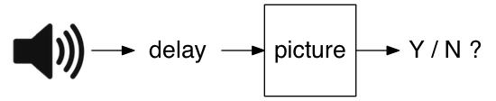
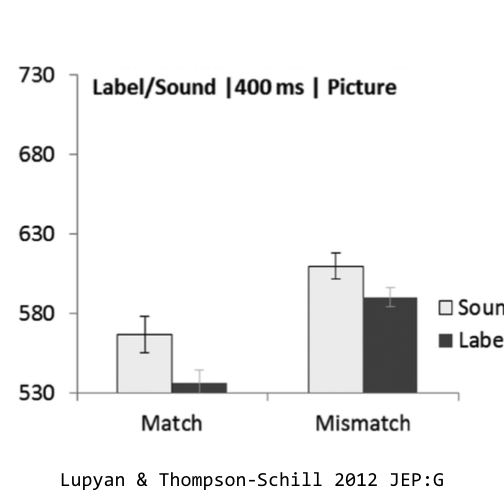

# How are word meanings represented in the brain?

##

<aside class="notes">
I study how word meanings are represented in the brain. Specifically what I’m interested in is how word meanings are represented differently than other types of information or meaning that we learn from the environment around us.
</aside>

##

<aside class="notes">
An example I use a lot is the canonical dog. How is the meaning of the word "dog" represented in the brain and how is it different from the other information we know about dogs?
</aside>

<aside class="notes">
You all know a lot about dogs: you know what they are and what they look like, and there are a few different ways I can get you to think about dogs. I can show you this picture of course but I can also just say the word “dog” and hearing this word will activate at least some of your knowledge about dogs.

But I don’t need to use language, I bet I can get you to think about dogs by playing you this sound.
</aside>

  <audio src="http://sapir.psych.wisc.edu/meri/bark.wav" controls>

# Different cues to the same concept

<aside class="notes">
So what’s the difference between a dog <bark> and the word “dog”? What’s the difference between verbal and nonverbal cues for activating the same underlying knowledge? The first experiments I’m going to tell you about address this question.
</aside>

|word           |sound             |
|:--------------|:-----------------|
|"dog"          |`<bark>`          |
|"cat"          |`<meow>`          |
|"chainsaw"     |`<revving>`       |
|"bowling ball" |`<crashing pins>` |

<aside class="notes">
What we did was two types of cues: verbal and nonverbal cues to arguably the same concept, like the word "dog" and the sound of a dog <bark>.
</aside>

# Picture verification task

##

<aside class="notes">
To test this we used what is called a picture verification task. If you were a subject in this experiment, here is what you would have done. You'd be holding a game controller, and on each trial you'd hear some sound, like the word "dog" or the sound of a dog <bark>, and then you'd see a picture, either a picture of a dog, or a picture of something else. And you'd have to decide does what I see match what I heard -- is this a picture of a dog, or is it a picture of something else? If they match you press one button, and if they don't, you press another button. And you do this 400 times. (Fun game!).
</aside>

##

<aside class="notes">
From some previous work by my advisor Gary Lupyan and Sharon Thompson-Schill we know that people are overall faster at this task when cued with words than with nonverbal environmental sounds. And this actually isn't just a product of not being given enough time to process the nonverbal sounds. If you give people more time between the cue and the picture, the label advantage actually gets a bit bigger. And it isn't due to just having more experience with words than the sounds either. People have no problem naming the sounds when they are played all by themselves, and when you make people learn new words and new sounds for "aliens and alien musical instruments" you still see some advantages of words over nonverbal equivalents.
</aside>

##

<aside class="notes">
So why are words better then sounds? One thing we've argued is that words are unmotivated cues. Thinking back to some of the categories we are talking about (e.g., dog, cat, chainsaw, bowling ball), different pictures of these objects can vary in degree to which they resemble the source of the sound.

These guitars are a good example. I can say the word "guitar" and you don't know which guitar I'm talking about. It's unmotivated. However, if I play you the sound of one of these guitars, you are pretty likely to be able to identify which one it came from. Nonverbal sounds are motivated to refer to a particular source.

We can think about this as a dimension of sound-picture congruence, basically. It's the idea that when I hear a nonverbal sound, it has some physical source out there in the world, and we wanted to know whether having a particular source sort of constrained the meaning of the sound even when people where specifically told to treat all guitars as the same, regardless of whether you heard an acoustic or an electric guitar.
</aside>

##

<aside class="notes">
So we ran people on a sound picture verification task where we varied the sound picture congruence, and even though people were encouraged to ignore this information, it turns out people are slower to match a sound to an incongruent picture -- an acoustic guitar sound to an electric guitar picture -- than they match those same images based on words.
</aside>

##

<aside class="notes">
So we ran people on a sound picture verification task where we varied the sound picture congruence, and even though people were encouraged to ignore this information, it turns out people are slower to match a sound to an incongruent picture -- an acoustic guitar sound to an electric guitar picture -- than they match those same images based on words.
</aside>

##

<aside class="notes">
</aside>

# Are word meanings perfectly symbolic?

<aside class="notes">
</aside>

# Property verification

<aside class="notes">
</aside>

#

##

  <video src="http://sapir.psych.wisc.edu/meri/big-teeth-tiger-no-mask.mov" controls></video>

##

  <video src="http://sapir.psych.wisc.edu/meri/longneck-swan-with-mask.mov" controls></video>

# Property verification

##

<aside class="notes">
</aside>

# Orientation discrimination

##

<aside class="notes">
</aside>

##

<aside class="notes">
</aside>

# Conclusions
