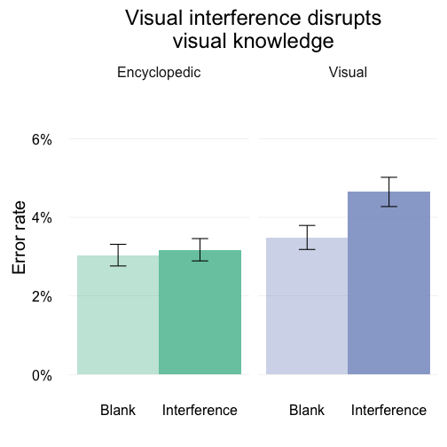

# How are word meanings represented in the brain?

<aside class="notes">
I study how word meanings are represented in the brain. Specifically what I’m interested in is how word meanings are represented differently than other types of information that we learn from the environment.
</aside>


<aside class="notes">
An example I use a lot is the canonical dog. How is the meaning of the word "dog" represented in the brain and how is it different from the other information we know about dogs?
</aside>


<aside class="notes">
You all know a lot about dogs: you know what they are and what they look like, and there are a few different ways I can get you to think about dogs. I can show you this picture of course but I can also just say the word “dog” and hearing this will activate at least some of your knowledge about dogs. But I don’t need to use language, I bet I can get you to think about dogs by playing you this sound.
</aside>

<div style="text-align: center;">
  <audio src="http://sapir.psych.wisc.edu/meri/bark.wav" controls>
    [Bark](http://sapir.psych.wisc.edu/meri/bark.wav)
  </audio>
</div>

# Different cues to the same concept

<aside class="notes">
This illustrates that there are different ways of cueing basically the same underlying knowledge, so what's the difference between a dog `<bark>` and the word “dog” when all I'm trying to do is get you to think about the concept or category of all dogs? What’s the difference between verbal and nonverbal cues for activating the same underlying knowledge?
</aside>


|word           |sound             |
|:--------------|:-----------------|
|"dog"          |`<bark>`          |
|"cat"          |`<meow>`          |
|"chainsaw"     |`<revving>`       |
|"bowling ball" |`<crashing pins>` |

<aside class="notes">
To test this, we compared two types of cues to arguably the same underlying concept, someone saying the word "dog" versus the sound of a dog `<bark>`.
</aside>

# Picture verification task


<aside class="notes">
In the experiment we had people complete what is called a picture verification task. If you were a subject in this experiment, here is what you would have done. You'd be holding a game controller, and on each trial you'd hear some sound, like the word "dog" or the sound of a dog `<bark>`, and then you'd see a picture, either a picture of a dog, or a picture of something else. And you'd have to decide, Does what I see match what I heard? Is this a picture of a dog, or is it a picture of something else? If they match you press one button, and if they don't, you press another button. And you do this 400 times. (Fun game!).
</aside>

# Label advantage


```
## Error in readPNG(full_name): unable to open static/img/lupyan_thompsonschill_2012_jepg_fig1a.png
```

```
## Error in grid.draw(label_advantage): object 'label_advantage' not found
```


<aside class="notes">
From some previous work by my advisor Gary Lupyan and Sharon Thompson-Schill we know that people are overall faster at this task when cued with words than when cued with nonverbal sounds. And this isn't just a product of not being given enough time to process the nonverbal sounds. If you give people more time between the cue and the picture, the label advantage actually gets a bit bigger. And it isn't due to just having more experience with words than the sounds either. People have no problem naming the sounds when they are played all by themselves, and when you make people learn new words and new sounds for "aliens and alien musical instruments" you still see some advantages of words over their nonverbal equivalents.
</aside>

# Words are unmotivated cues

<aside class="notes">
So why are words better than sounds? One thing we've argued is that words are **unmotivated cues**. Thinking back to some of the categories we are talking about (e.g., dog, cat, chainsaw, bowling ball), different pictures of these objects can vary in degree to which they resemble the source of the sound.
</aside>


```
## Error in img("guitar_acoustic.jpg"): could not find function "readJPG"
```

```
## Error in img("guitar_electric.jpg"): could not find function "readJPG"
```

```
## Error in rasterGrob(acoustic, x = 0.1, width = 0.5): object 'acoustic' not found
```

```
## Error in rasterGrob(electric, x = 0.9, width = 0.5): object 'electric' not found
```


<aside class="notes">
These guitars are a good example. I can say the word "guitar" and you don't know which guitar I'm talking about. It's unmotivated. However, if I play you the sound of one of these guitars, you are pretty likely to be able to identify which one it came from. Nonverbal sounds are motivated to refer to a particular source.
</aside>

<div style="text-align: center">
  <audio src="http://sapir.psych.wisc.edu/meri/acoustic_guitar.wav" controls>
    [Guitar 1](http://sapir.psych.wisc.edu/meri/acoustic_guitar.wav)
  </audio>
  <br />
  <audio src="http://sapir.psych.wisc.edu/meri/electric_guitar.wav" controls>
    [Guitar 2](http://sapir.psych.wisc.edu/meri/electric_guitar.wav)
  </audio>
</div>

<aside class="notes">
We can think about this motivation as setting up a dimension of **sound-picture congruence**. Basically it's the idea that when I hear a nonverbal sound, it has some physical source out there in the world that might in some ways constrain it's meaning even in situations when people are specifically told to ignore that information, and treat all guitars the same.
</aside>

#

##


<aside class="notes">
So we ran a version of the sound picture verification task where we varied the congruence between the sound and the picture, and even though people were instructed to ignore this information, it turns out people are slower to match a sound to an incongruent picture--an acoustic guitar sound to a picture of an electric guitar--than they match those same images based on words.

What's also interesting is that the label advantage exists even on congruent trials where the sound is arguably a better cue to the particular picture than even the word. We thought that this might be due to the fact that we are playing the sound well in advance of the picture. In the next experiment we tried to make the label advantage even smaller by playing the sounds at the same time as the pictures, basically we were trying to do as much as possible to imitate the real world experience of hearing these sounds in the lab.
</aside>

##


<aside class="notes">
So here I'm just showing the difference between the trial types, on the top is a delayed trial and on the bottom is a simultaneous trial. People are doing the same thing, we are just varying when they hear the sound relative to the picture. Our idea was that by playing the sound and the picture at the same time, we might further motivate the sound picture congruence, making the label advantage even smaller.
</aside>

##


<aside class="notes">
So here's what we found. We found we could make the label advantage disappear under two conditions: first, it had to look like the sound came from the picture. In this experiment we used a continuous measure of sound picture congruence, but the dimension is otherwise the same, and as expected participants exhibited a smaller label advantage for pictures that were highly congruent with the matching sound. The second condition was that the sound and the picture had to be played at the same time. So time is another dimension that constrains the meaning of sounds but not words.
</aside>

# So, word meanings are abstract? (Big whoop!)

<aside class="notes">
What we've shown is that one of the ways word meanings are different from other types of meaning is that they are more symbolic and categorical, and they don't have to refer to a particular member of a category. Now, of course, I don't think this would come to a surprise to any of you, so why is this interesting?

Well, now I'm going to switch gears and give you some evidence on the other side of this debate, and show you some of the ways in which word meanings are not as abstract or symbolic as we might think.
</aside>

# Property verification

<aside class="notes">
For the next experiment we had people complete a similar sort of task in that people are responding yes or no, but instead of verifying a picture they are verifying some well known property of an object. Basically we just asked people yes or no questions about familiar objects and items. So we asked people whether or not an alligator has a long tail or whether strawberries are red.
</aside>


<aside class="notes">
What we were interested in is whether the knowledge that you use to answer this question is represented symbolically or if answering a question about visual knowledge actually requires visual mechanisms. If it does, then we should be able to disrupt your ability to answer these questions by presenting visual interference while you are answering the questions.

Let me show you an example trial.
</aside>

#

##

<aside class="notes">
Here is a sample trial. First you'll get a question, then they'll be a delay, and then you'll hear the name of an object, and just decide for yourself as quickly as you can whether or not the answer is yes or no.
</aside>

<div style="text-align: center">
  <video src="http://sapir.psych.wisc.edu/meri/big-teeth-tiger-no-mask.mov" controls>
    [Sample trial 1](http://sapir.psych.wisc.edu/meri/big-teeth-tiger-no-mask.mov)
  </video>
</div>

##

<aside class="notes">
Here's another trial, and this one shows the visual interference manipulation.
</aside>

<div style="text-align: center">
  <video src="http://sapir.psych.wisc.edu/meri/longneck-swan-with-mask.mov" controls>
    [Sample trial 2](http://sapir.psych.wisc.edu/meri/longneck-swan-with-mask.mov)
  </video>
</div>

<aside class="notes">
Our thought was that if visual knowledge depended on visual mechanisms, then you might be slower and less accurate to answer a question about the visual features of an object, but, we want to make sure that this isn't just due to the visual interference being distracting, so we can compare you performance on the visual questions to your performance on equally difficult nonvisual questions.
</aside>

# Property verification



<aside class="notes">
Here are the results. We found that when people were asked about the nonvisual, encyclopedic properties of the objects, the visual interference had no effect. If you were asked whether alligators lived in Florida, this information could not be disrupted by visual interference. If however you were asked whether alligators had big teeth or about some other visual property of the object, then visual interference had an effect, making errors more likely.

What this means is that the meaning of the word alligator, some of the visual properties of alligators that are somehow stored in your brain, is represented in a visual format.
</aside>

# Orientation discrimination

##


<aside class="notes">
</aside>

##


<aside class="notes">
</aside>

# A paradox?
