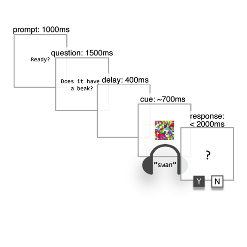

# How are word meanings represented in the brain?
 
<aside class="notes">
I study how word meanings are represented in the brain. Specifically what I’m interested in is how word meanings are represented differently than other types of information we can learn and remember.
</aside>

<aside class="notes">
An example I use a lot is the canonical dog. How is the meaning of the word "dog" represented in the brain and how is it different from other information we know about dogs? For example, we also know that dogs `<bark>`. If all I'm trying to do is get you to think about dogs, how do these two cues compare? 
</aside>

  <audio src="http://sapir.psych.wisc.edu/meri/dog.wav" controls>
    ["dog"](http://sapir.psych.wisc.edu/meri/dog.wav)
  </audio>
   
  <audio src="http://sapir.psych.wisc.edu/meri/bark.wav" controls>
    [`<bark>`](http://sapir.psych.wisc.edu/meri/bark.wav)
  </audio>

# Different cues to the same concept

<aside class="notes">
To test this, we compared verbal and nonverbal cues to the same categories of objects.
</aside>

|word           |sound             |
|:--------------|:-----------------|
|"dog"          |`<bark>`          |
|"cat"          |`<meow>`          |
|"chainsaw"     |`<revving>`       |
|"bowling ball" |`<crashing pins>` |
|"..."          |`<...>`           |

# Picture verification task

<aside class="notes">
In the experiment people completed what's called a picture verification task. On each trial, they heard a sound, like the word "dog" or the sound of a dog `<bark>`, and then they saw a picture, either a picture of a dog, or a picture of something else. All they had to do was decide, Does what I see match what I heard? Is this a picture of a dog, or is it a picture of something else? And they did this about 400 times. (Fun game!).
</aside>

# Label advantage

<aside class="notes">
From some previous work by my advisor Gary Lupyan and Sharon Thompson-Schill we know that people are overall faster at this task when cued with words than when cued with nonverbal sounds. I'll call this the label advantage. It's important to note that this isn't just because people don't have enough time to process the sounds, and it's also not due to being more familiar with the words than the sounds.
</aside>

# Words are unmotivated cues

<aside class="notes">
So why are words better than sounds? One thing we've argued is that words are **unmotivated cues**.
</aside>

<aside class="notes">
These guitars are a good example. I can say the word "guitar" and you don't know which guitar I'm talking about. It's unmotivated. However, if I play you the sound of one of these guitars, you are likely to know which one it came from.
</aside>

  <audio src="http://sapir.psych.wisc.edu/meri/acoustic_guitar.wav" controls>
    [Guitar 1](http://sapir.psych.wisc.edu/meri/acoustic_guitar.wav)
  </audio>
   
  <audio src="http://sapir.psych.wisc.edu/meri/electric_guitar.wav" controls>
    [Guitar 2](http://sapir.psych.wisc.edu/meri/electric_guitar.wav)
  </audio>

<aside class="notes">
We wanted to know whether this **sound picture congruence** might actually be constraining the meaning of the nonverbal cues even when people are instructed specifically to ignore that information and treat all guitars as the same.
</aside>

#

##

<aside class="notes">
We ran a version of the picture verification task where we varied the congruence between the sound and the picture, and found that we could get rid of the label advantage under two conditions. First, the object in the picture had to look like it could have generated the sound that people heard. People were the slowest on the incongruent sound trials, so where they heard an acoustic guitar and saw a picture of an electric guitar.
</aside>

<aside class="notes">
What's interesting is that the label advantage persisted even on the congruent sound trials. To fully get rid of the label advantage, we had to do one more thing, and that is to play the cue at the same time as the picture.
</aside>

##

<aside class="notes">
Here I'm showing the difference between the trial types. They are both the same picture verification task but the bottom illustrates a trial where the cues were played simultaneously with the images.
</aside>

##

<aside class="notes">
And here's what we found. I'm showing you response times for the simultaneous trials, and the difference between the lines is the label advantage, and you see that that label advantage disappears when there is high sound picture congruence.
</aside>

# So, word meanings are abstract? (Big whoop!)

<aside class="notes">
What this suggests is that one of the ways word meanings are different from other types of meaning is that they are more symbolic and categorical, and they don't have to refer to a particular member of a category. You might be asking yourself, why is this surprising? Didn't we already know that?

Well, let me switch gears and give you some evidence on the other side of this debate, and show you some of the ways in which word meanings are not as abstract or symbolic as we might think.
</aside>

# Property verification

<aside class="notes">
For the next experiment we had people complete a similar sort of task where they answered simple yes or no questions this time about the properties of familiar animals and objects. For example, one of the questions was "Does a swan have a beak?"
</aside>

<aside class="notes">
What we were interested in is whether the knowledge that you use to answer this question is represented symbolically or if answering a question about visual knowledge actually requires visual mechanisms. If it does, then we should be able to disrupt performance by presenting visual interference while answering the question. Let's look at some sample trials.
</aside>

#

##

  <video src="http://sapir.psych.wisc.edu/meri/big-teeth-tiger-no-mask.mov" controls>
    [Sample trial 1](http://sapir.psych.wisc.edu/meri/big-teeth-tiger-no-mask.mov)
  </video>

##

  <video src="http://sapir.psych.wisc.edu/meri/longneck-swan-with-mask.mov" controls>
    [Sample trial 2](http://sapir.psych.wisc.edu/meri/longneck-swan-with-mask.mov)
  </video>

# Property verification

<aside class="notes">
Our prediction was that if the knowledge of what things look like is represented in a visual format, then visual interference should disrupt visual and only visual knowledge, and that's what we found. When people were asked about the nonvisual, encyclopedic properties of the objects, visual interference had no effect. If however you were asked a visual question--whether alligators had big teeth--then visual interference made errors more likely.
</aside>

# Conclusions

##

- Word meanings are represented more abstractly than nonverbal meanings.
- Visual word meanings are represented using at least some visual mechanisms.

## A paradox?

## 

<aside class="notes">
</aside>

# Thank you!

Pierce Edmiston  
<pedmiston@wisc.edu>

[<small>Slides: github.com/pedmiston/studying-word-meanings</small>](https://github.com/pedmiston/studying-word-meaings)
[<small>Edmiston & Lupyan (2015). What makes words special? Words as unmotivated cues. _Cognition_.</small>](http://sapir.psych.wisc.edu/papers/edmiston_lupyan_2015_motivated.pdf)  
[<small>Edmiston & Lupyan (2016). Visual interference disrupts visual knowledge. _Journal of Memory and Language_.</small>](http://sapir.psych.wisc.edu/papers/edmiston_lupyan_JML.pdf)
